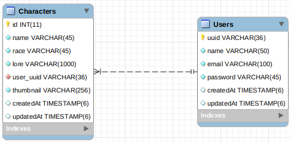

# Valhalla

### Valhalla é um projeto criado com o intuito de exercitar e aprender mais sobre React, Redux, NodeJs, Sequelize e TypeScript

## Back-End

As tecnologias utilizadas no Back-end são :

1. NodeJs
1. TypeScript (Não está totalemente adequado )
1. Sequelize ( ORM , Mapeamento objeto-relacional )
1. MySql

Próximos passos:

1. Terminar o Login/Autenticação Utilizando JWT.
1. Adicionar controle por Migrations.
1. Arrumar o TypeScript adequandamente. ( falta a tipagem em alguns arquivos)

O Back-end ainda não utiliza as Migrations do Sequelize para criação e manutenção do banco de dados, então o script de criação do banco se encontra dentro da pasta :

> \$/ back-end/docuementation/scriptBanco.sql

#### Modelo de Banco de dados:

Os arquivos contidos dentro da pasta 'Documentation' estão relacionados a configuração do ambiente de desenvolvimento com o TypeScript.

**Para iniciar o Back-end:**  
_Verifique se entá dentro da pasta 'back-end' e execute os comandos:_

> yarn install  
> yarn dev

O back-end deve ser startado na porta _3333_.

## Front-end (Densenvolvendo)

As tecnologias utilizads no Front-end.

1. React
1. React-Router-Dom

Próximos passos:

1. Integração com o back-end utilizando Redux, Redux-Saga.
1. Alterar a estilização, trocando o CSS por Styled-Components.
1. Melhorar Organização de Pastas e Arquivos.
1. Utilização de Bundlers.
1. Criar Pagina e função no back-end para 'Esqueci minha senha'.

**Para iniciar o Front-end:**  
_Verifique se entá dentro da pasta 'front-end' e execute os comandos:_

> yarn install  
> yarn start
